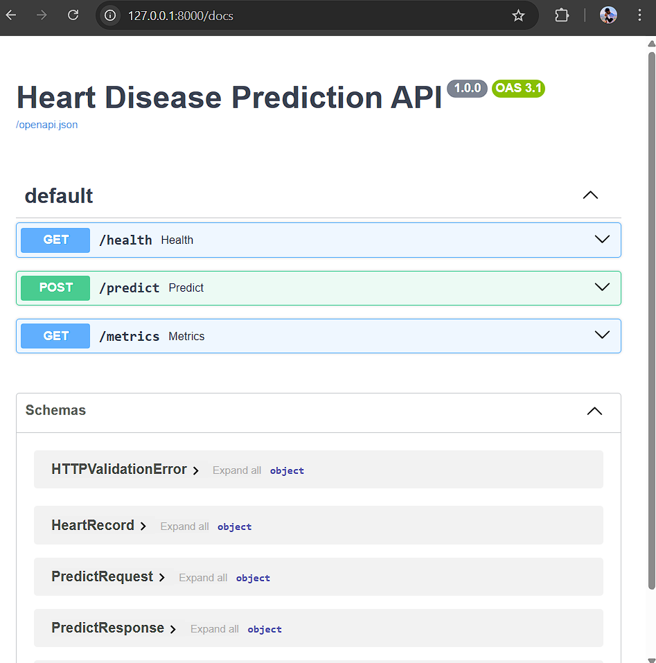
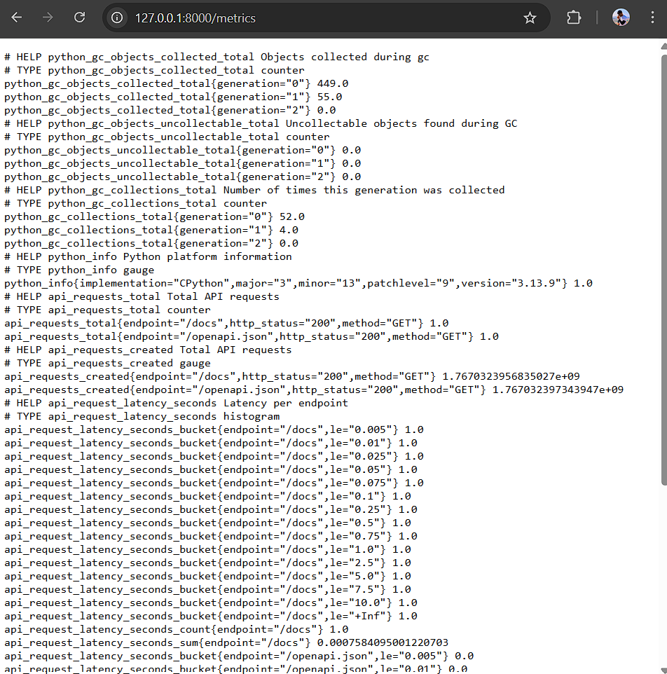

# MLOps Assignment 1 - Group Report

This report outlines our submission for the MLOps assignment, covering the end-to-end machine learning pipeline from data acquisition to production deployment.

## 1. Setup & Installation
The entire application has been containerized to ensure reproducibility across environments.

**Local Execution:**
```bash
# Install dependencies
pip install -r requirements.txt

# Download and prepare data
python data/download_data.py
```

## 2. EDA & Modeling Choices
We utilized the UCI Heart Disease dataset for this analysis.

- **Data Cleaning**: We used standard pandas-based preprocessing to handle missing values before training.
- **EDA**: We analyzed class balance and feature correlations to understand the dataset's structure. The generated visualizations are available in the `reports/figures` directory.
- **Model Selection**: We evaluated Logistic Regression and Random Forest classifiers.
    - **Decision**: We selected **Logistic Regression** for the final deployment due to its interpretability and sufficient performance (ROC-AUC) for this baseline task.

## 3. Experiment Tracking
We integrated **MLflow** to track all experiment runs.
- **Metrics**: Each training run logs critical metrics such as accuracy, precision, recall, and ROC-AUC.
- **Artifacts**: The trained model pipeline and configuration parameters are versioned and stored for every experiment.
- **Usage**: The UI can be accessed via `mlflow ui` to compare different model iterations.

## 4. Architecture Diagram
The system follows a standard MLOps architecture:
`Data Source -> Preprocessing Pipeline (Imputation + Scaling/Encoding) -> Model Training -> FastAPI Inference Service -> Docker Container -> Kubernetes Cluster`

The saved model artifact (`models/log_reg_pipeline.joblib`) encapsulates the scaling and encoding steps.

## 5. CI/CD & Deployment
- **CI/CD Pipeline**: We implemented a GitHub Actions workflow that triggers on every push to the main branch. The pipeline performs the following steps:
    1.  **Linting**: Checks code quality using `ruff`.
    2.  **Testing**: Runs unit tests via `pytest` to verify data pipelines and model predictions.
    3.  **Training**: Retrains the model on the latest code/data.
    4.  **Artifact Upload**: Archives the trained model and reports.
- **Containerization**: The application is packaged using a `Dockerfile` based on `python:3.12-slim` for efficiency.
- **Kubernetes**: A `deployment.yaml` manifest defines the Service and Deployment resources, including readiness and liveness probes to ensure high availability.

**Screenshots:**
Below are the screenshots demonstrating our deployment and CI/CD success:


*Figure 1: FastAPI Swagger UI running locally*


*Figure 2: Prometheus Metrics Endpoint*


*Figure 3: Successful CI/CD Pipeline Run*

## 6. Monitoring
The API is instrumented with **Prometheus** metrics exposed at the `/metrics` endpoint.
- **Key Metrics**: We monitor `api_requests_total` and latency to observe traffic patterns and system performance.

---
**Link to Code Repository**: [https://github.com/rohanbhirud/MLOPS-Assignment-1.git](https://github.com/rohanbhirud/MLOPS-Assignment-1.git)
